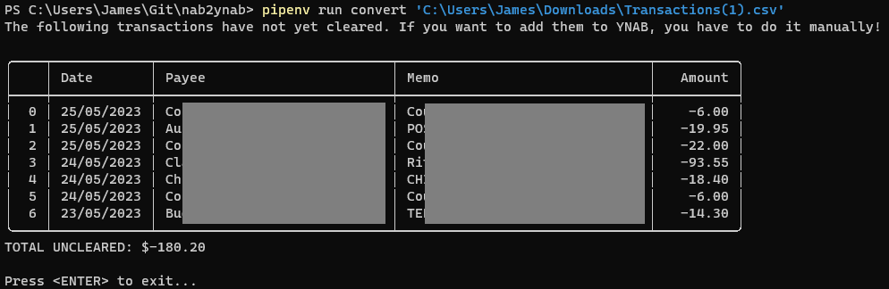
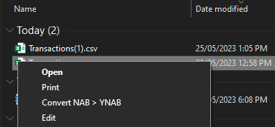
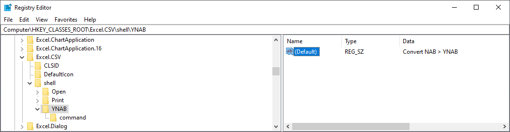
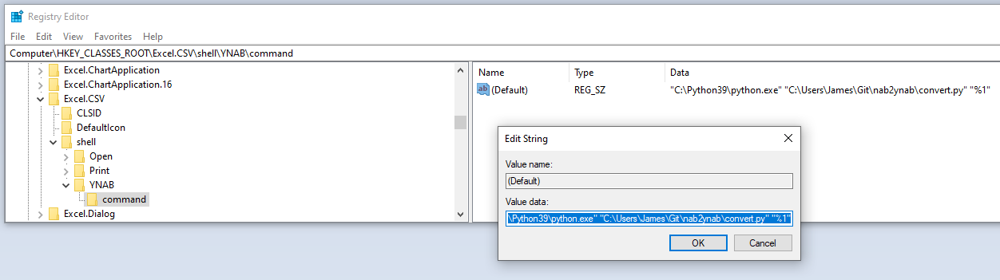

# NAB CSV to YNAB CSV

This is a simple Python script that takes a CSV transaction dump from National Australia Bank (NAB)
and re-processes it in-place for consumption by You Need A Budget (YNAB).

## Example output


## Usage

```sh
pipenv run convert my-transactions-list.csv
```

## Power user mode

I wrote this tool to run from a RMB click on my transactions CSV in Windows Explorer, like this:



To set this up, you need to add a registry key. You're somewhat on your own here, as it will depend
how you have Python setup on your machine, but the basic process is as follows.

_(refer to the screenshots below if you get stuck)_

1. Open the Registry Editor (Run prompt: `regedit`)
2. Naviage to `Computer\HKEY_CLASSES_ROOT\Excel.CSV\shell`.
   If you don't have Excel installed, potentially you will need to instead
   go to `Computer\HKEY_CLASSES_ROOT\csv\shell` (but I'm not sure)
3. From the key list on the left side of the Registry Editor, right-click on **shell** and select **New > key**
5. Name the new key **YNAB**
6. With the YNAB key selected, on the right-hand side you will see a String (REG_SZ) value named **(Default)**.
7. Edit this (right-click, Modify...) and set the Value data to _"Convert NAB > YNAB"_ (without the quotes).
   This is the text you will see when you right-click a CSV.
10. Now, on the left side, right-click on **YNAB** and, again, select **New > key**. Name this new key **command**
11. With the **command** key selected, on the right-hand side, again edit the **(Default)** string value.
12. This is where we set the command that will be run. The command is made up of three parts:
    - The Python executable (for me, it is C:\Python39\python.exe)
    - The full path to convert.py
    - "%1" (this will be replaced with the path of the CSV you right-click on)

### Registry Editor Screenshots





